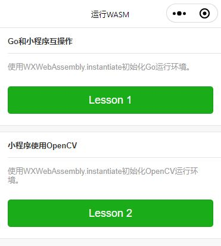

## 更新日志

| 日期　　　| 内容 |
| -- | -- |
| 2021-12-05 | 新增：微信小程序运行OpenCV的示例。也包含网页运行OpenCV的示例。 |
| 2021-12-03 | 新增：微信小程序运行Go语言的示例。也包含网页运行Go语言的示例。 |

## 介绍

1、将Go语言编译为WebAssembly，使用微信小程序的WXWebAssembly功能运行WebAssembly。

因为Go语言能快速开发WebAssembly，所以使用Go语言能为小程序快速开发WebAssembly。

2、在微信小程序中使用WebAssembly版的OpenCV，让我们开发图像视觉。

[WXWebAssembly官方文档](https://developers.weixin.qq.com/miniprogram/dev/framework/performance/wasm.html)

## 网页版

在线预览，和小程序版使用的是相同的wasm文件。

运行Go

[https://sanyuered.github.io/WeChat-MiniProgram-AR-WASM/go_dev/lesson1.html](https://sanyuered.github.io/WeChat-MiniProgram-AR-WASM/go_dev/lesson1.html)

运行OpenCV

[https://sanyuered.github.io/WeChat-MiniProgram-AR-WASM/opencv_dev/lesson2.html](https://sanyuered.github.io/WeChat-MiniProgram-AR-WASM/opencv_dev/lesson2.html)

## 小程序版

首页



## Go调用小程序的函数

Go运行时，会调用小程序的console.log()输出信息。


在调试窗口的Console面板查看


## 小程序调用Go的函数

每次点击按钮，次数会增加1。


## 小程序调用Go的函数, Go回调小程序。

输入内容是可编辑的自定义文本。


点击按钮后，输出内容会返回输入的自定义文本。Go语言一侧使用了time.Sleep()和协程，模拟了等待2秒的异步方法调用。


## 小程序调用OpenCV的函数。

灰度化


边缘检测


特征点检测


## 目录结构

/：小程序一侧的源代码

/go_dev：Go一侧的源代码

/node_dev： Node一侧的源代码

/miniprogram_npm：微信开发者工具将npm包text-encoder编译后的文件。

/project.config.json：小程序打包时，排除node_dev、go_dev等目录。

```javascript
    "packOptions": {
        "ignore": [
            {
                "type": "folder",
                "value": "screenshot"
            },
            {
                "type": "folder",
                "value": "node_dev"
            },
            {
                "type": "folder",
                "value": "go_dev"
            }
        ]
    },
    
```

## Go一侧的源代码

Go一侧和网页版wasm的开发完全一样，没有区别。但不要调用fmt.Println()。

```javascript
func main() {
	// 创建通道
	channel := make(chan int)
	// Go调用js的console.log()方法,在开发者工具的Consol面板中查看。
	console := js.Global().Get("console")
    console.Call("log", "hello, world!")
    // 其它代码省略

	// 通道阻塞了main()方法
    <-channel
    
```

网页端运行Go：/go_dev/lesson1.html

```javascript
    const go = new global.Go();
	try {
        const result = await WebAssembly.instantiateStreaming(fetch(wasm_url), go.importObject)
        // 运行go程序的main()方法
        await go.run(result.instance);
        // 其它代码省略
    } catch (err) {
        console.error('initGo', err)
    }

```

小程序端运行Go：/package_lesson1/index.js

注意：wasm_url必须是小程序打包的文件，不能是网络文件和下载后保存的文件。wasm文件会占用小程序打包后的大小，所以小程序每个分包中的wasm文件不能大于2MB。

```javascript
   const go = new global.Go();
    try {
        const result = await WXWebAssembly.instantiate(wasm_url, go.importObject)
        // 运行go程序的main()方法
        await go.run(result.instance);
        // 其它代码省略
    } catch (err) {
        console.error('initGo', err)
    }

```

## Node一侧的源代码

Node一侧是将.wasm压缩为.wasm.br文件。小程序每个分包限制大小为2MB，但支持.wasm.br压缩文件。使用brotli压缩.wasm文件，能压缩到原始.wasm文件大小的20%至25%。

但是brotli压缩速度很慢。1.4MB的.wasm，压缩为.wasm.br，花费时间约6秒。文件更大的.wasm，压缩时间更长，可能花费几分钟。

```javascript
// 第三方的wasm版本brotli压缩和解压缩
var brotli = require('wasm-brotli');
// 压缩文件的示例
async function compressFile(){
    const content = await readFileAsync('../go_dev/sample.wasm');
    const compressedContent = await brotli.compress(content);
    // 其它代码省略
}

```

## 技术难点

### 1、小程序分包大小不能超过2MB，Go的Hello World示例编译为wasm文件大小就超过2MB了。

解决方法：1、使用brotli工具压缩wasm，压缩率约22%，理论上支持最大8MB的未压缩wasm。

### 2、如何修改wasm_exec.js文件？

解决方法：修改的位置使用了变量IsWechat，判断是否是小程序环境。具体修改请见源代码。
```javascript
const IsWechat = true;
```

### 3、小程序没有crypto.getRandomValues()方法。
解决方法：
```javascript
    if (!global.crypto) {
        global.crypto = {
            getRandomValues(b) {
                let byteRange = 256;
                for (var i = 0; i < b.length; i++) {
                    b[i] = Math.floor(byteRange * Math.random());
                }
            },
        };
    }
```

### 4、小程序没有performance.now()方法。
解决方法：
```javascript
   if (!global.performance) {
        global.performance = {
            now() {
                return Date.now()
            },
        };
    }
```

### 5、小程序没有TextDecoder和TextDecoder对象。
解决方法：
```javascript
  	if (!global.TextEncoder) {
        global.TextEncoder = require("text-encoder").TextEncoder;
    }
    if (!global.TextDecoder) {
        global.TextDecoder = require("text-encoder").TextDecoder;
    }
```

## Go和小程序互操作

js.Global() ：获取js运行环境的global对象。
```javascript
console := js.Global().Get("console")
```

js.ValueOf ：Go对象的值转换为js对象。
```javascript
func addTotal(this js.Value, args []js.Value) interface{} {
    // 其它省略
    return js.ValueOf(totalNum)
}
```

js.Value  ：js对象的值转换为Go对象。
```javascript
func asyncAndCallbak(this js.Value, args []js.Value) interface{} {
	// js输入参数
    input := args[0].String()
    // js回调函数
    callback := args[1]
    // 其它省略
}
```

js.FuncOf  ：Go函数转换为js函数。
```javascript
    // js调用Go的addTotal()方法
	js.Global().Set("addTotal", js.FuncOf(addTotal))
```

Object.Call(function1,arg1,arg2) ：在js对象上调用方法function1,输入参数arg1、arg2等。
```javascript
    // Go调用js的console.log()方法,在开发者工具的Consol面板中查看。
    console := js.Global().Get("console")
    console.Call("log", "hello, world!")
```

function1.Invoke(arg1,arg2) ：调用方法function1,输入参数arg1、arg2等。
```javascript
func asyncAndCallbak(this js.Value, args []js.Value) interface{} {
    // js回调函数
    callback := args[1]
    // 运行js回调函数
	callback.Invoke(result)
    // 其它省略
}
```

Object.Get(prop1) ：获取js对象的子对象、属性、方法等。	
```javascript
console := js.Global().Get("console")
```

注意：使用js.Global().Get("console")，需要在小程序基础类库的global对象上，增加console对象。
```javascript
	async onReady() {
		// 在小程序基础类库的global对象上，增加console对象。
		global.console = console
		// 使用小程序类库的WXWebAssembly，初始化Go运行环境。
		await this.initGo()
	},
```
	
Object.Set(prop1,value1)：设置js对象的子对象、属性、方法等。
```javascript
// 在js运行环境，设置Go的addTotal()方法
js.Global().Set("addTotal", js.FuncOf(addTotal))
```


## Go和JavaScript的变量类型

```javascript
| Go                     | JavaScript             |
| ---------------------- | ---------------------- |
| js.Value               | [its value]            |
| js.Func                | function               |
| nil                    | null                   |
| bool                   | boolean                |
| integers and floats    | number                 |
| string                 | string                 |
| []interface{}          | new array              |
| map[string]interface{} | new object             |

```

## 已知问题

### Q1：syscall/js: call of Value.Invoke on undefined

A：使用fmt.Println("hello,world")会发生该错误，但使用fmt.Sprintf("%d", 123) 正常。不要使用fmt.Println()方法，而使用console.log()方法向小程序输出调试信息。

### Q2：LinkError: WebAssembly.instantiate(): Import #4 module="go" 

A: wasm_exec.js中的方法有的能去掉，有的不能去掉。 如果修改wasm_exec.js，则importObject.go对象中的所有方法名称需要保留。

### Q3：从Go调用小程序的wx.showModal({title:"123"})等API发生错误

A：如果运行wx := js.Global().Get("wx");wx.Call("showModal", "");，则可以显示一个空白的对话框。Go可以调用小程序API，问题出在wx.Call("showModal", object)的输入参数是Object类型。

在网页端WebAssembly，Go能正常传递Object给网页。

在小程序端WebAssembly，Go无法正常传递Object给小程序。将方法的输入参数从Object类型暂时换成其他变量类型。

